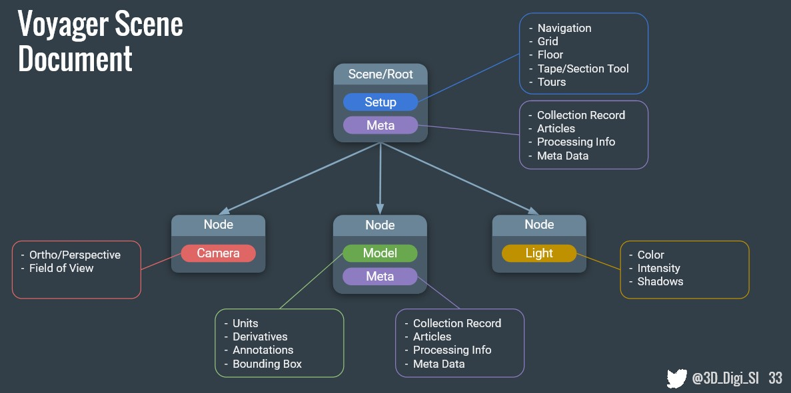

### The Voyager JSON Document Format (SVX)

Voyager Explorer (the viewer) and Voyager Story (the authoring tool) work with JSON scene description files.
The structure of this custom file format is very similar to the well known and widespread glTF format. glTF is an industry
standard for the transmission of 3D scenes on the web, including mesh, material, texture and animation data. While Voyager
document files are not directly compatible with glTF, their data structure is similar enough to make it easy to read
for developers experienced with glTF.

- More information about GLTF: https://github.com/KhronosGroup/glTF

Voyager documents use the specific extension `.svx.json` so they can be easily recognized and distinguished from other
`.json` files.
 
_SVX_ stands for _Smithsonian Voyager eXperience_.

### Scenes, Nodes, and Components

Both glTF and SVX describe 3D scenes using nodes. Each node has a name, and a location and orientation in 3D space.
In SVX, each node contains a number of components. A component gives a node specific properties. SVX documents support
the following component types:

- **Camera**
- **Light** (a light source; directional, point, and spot lights are supported)
- **Model** (an entity displayable in 3D space, including annotations)
- **Meta** (model and collection meta data, articles, media, etc.)
- **Setup** (scene setup information)

A node may contain multiple components. For example, a node may have both a **model** component (describing the 3D data
to be displayed) and a **meta** component (describing the meta data for the model).

